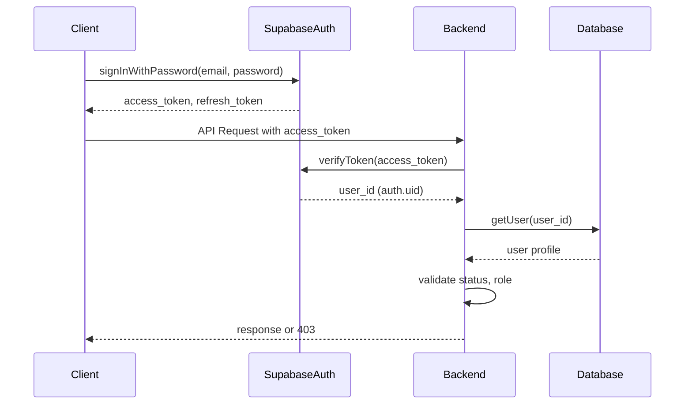
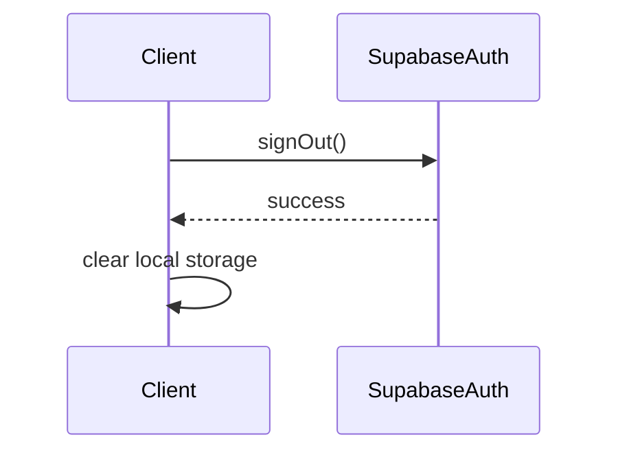

# Supabase Auth Implementation Plan

## 1. Exact Database Changes

### Current `public.users` Table Structure
```sql
CREATE TABLE public.users (
  id UUID PRIMARY KEY,
  employee_id TEXT UNIQUE,
  name TEXT NOT NULL,
  email TEXT UNIQUE,
  phone TEXT,
  role TEXT NOT NULL,
  gate_id UUID REFERENCES gates(id),
  password_hash TEXT,
  pin TEXT,
  parent_id UUID REFERENCES users(id),
  supervised_gates UUID[],
  assigned_hostel TEXT,
  is_hod BOOLEAN,
  department_id TEXT,
  can_view_gender BOOLEAN,
  status TEXT NOT NULL,
  created_at TIMESTAMPTZ NOT NULL DEFAULT NOW(),
  updated_at TIMESTAMPTZ
);
```

### Target `public.users` Table Structure
```sql
CREATE TABLE public.users (
  id UUID PRIMARY KEY, -- Matches auth.users.id
  employee_id TEXT UNIQUE,
  name TEXT NOT NULL,
  email TEXT UNIQUE NOT NULL, -- Required for Supabase Auth
  phone TEXT,
  role TEXT NOT NULL,
  gate_id UUID REFERENCES gates(id),
  pin_hash TEXT, -- For PIN verification (hashed)
  initial_pin_hash TEXT, -- Temporary for initial provisioning (hashed)
  parent_id UUID REFERENCES users(id),
  supervised_gates UUID[],
  assigned_hostel TEXT,
  is_hod BOOLEAN,
  department_id TEXT,
  can_view_gender BOOLEAN,
  status TEXT NOT NULL,
  auth_provider TEXT NOT NULL DEFAULT 'email', -- Track authentication method
  last_password_change TIMESTAMPTZ,
  created_at TIMESTAMPTZ NOT NULL DEFAULT NOW(),
  updated_at TIMESTAMPTZ,
  CONSTRAINT fk_users_auth FOREIGN KEY (id) REFERENCES auth.users(id) ON DELETE CASCADE
);
```

### Database Changes Summary

| Change | Action | Rationale |
|--------|--------|-----------|
| Remove `password_hash` | Remove column | Passwords managed by Supabase Auth |
| Add `email` NOT NULL constraint | Modify column | Required for Supabase Auth |
| Add `auth_provider` | Add column | Track authentication method |
| Add `last_password_change` | Add column | Security tracking |
| Add `pin_hash` | Add column | Store hashed PINs for verification |
| Add `initial_pin_hash` | Add column | Temporary storage for initial PIN provisioning |
| Add foreign key to `auth.users` | Add constraint | Enforce 1:1 relationship with Supabase Auth |
| Remove `pin` | Remove column | Replace with hashed version |

### Indexes to Add
```sql
-- Ensure email is indexed for Supabase Auth lookups
CREATE INDEX idx_users_email ON public.users(email);

-- Ensure employee_id is indexed for login identifier lookups
CREATE INDEX idx_users_employee_id ON public.users(employee_id);
```

## 2. Exact Authentication Changes

### Current Authentication Flow
1. Client → POST `/api/auth/login` with {login, password}
2. Server → `verifyLogin(login, password)`
3. Server → `signToken(user, sessionId)`
4. Server → Create session in `public.sessions`
5. Server → Return custom JWT
6. Client → Include JWT in Authorization header
7. Server → `verifyToken()` in auth middleware
8. Server → Validate session from `public.sessions`

### Target Authentication Flow
1. Client → Authenticate with Supabase Auth using email + password
2. Supabase → Return access token + refresh token
3. Client → Include access token in Authorization header
4. Server → Validate token with Supabase
5. Server → Retrieve user from `public.users` using `auth.uid()`
6. Server → Validate account status and role
7. Server → Grant access based on authorization rules

### Authentication Implementation Details

#### Login Flow


#### Logout Flow


#### Token Validation Middleware
```typescript
// New auth middleware
export async function withSupabaseAuth(handler: NextApiHandler) {
  return async (req: NextRequest) => {
    // Extract token from Authorization header
    const authHeader = req.headers.get('authorization');
    if (!authHeader?.startsWith('Bearer ')) {
      return NextResponse.json({ error: 'Unauthorized' }, { status: 401 });
    }

    const token = authHeader.slice(7);

    // Verify token with Supabase
    const { data: { user }, error } = await supabase.auth.getUser(token);

    if (error || !user) {
      return NextResponse.json({ error: 'Invalid token' }, { status: 401 });
    }

    // Get user profile from public.users
    const { data: profile, error: profileError } = await supabase
      .from('users')
      .select('*')
      .eq('id', user.id)
      .single();

    if (profileError || !profile) {
      return NextResponse.json({ error: 'User not found' }, { status: 404 });
    }

    // Validate account status
    if (profile.status !== 'ACTIVE') {
      return NextResponse.json({ error: 'Account inactive' }, { status: 403 });
    }

    // Attach user to request
    const requestHeaders = new Headers(req.headers);
    requestHeaders.set('x-user-id', profile.id);
    requestHeaders.set('x-user-role', profile.role);

    return handler(req);
  };
}
```

## 3. Login ID Architecture

### Email Aliasing Implementation

**Approach**: Use email as the primary authentication identifier while displaying approved application IDs in the UI.

#### Database Schema Changes
```sql
-- Add login_identifier column to track the approved ID
ALTER TABLE public.users ADD COLUMN login_identifier TEXT UNIQUE;

-- Add index for login identifier lookups
CREATE INDEX idx_users_login_identifier ON public.users(login_identifier);
```

#### Login Flow Implementation
1. **User Registration**:
   - Administrator creates user in Supabase Auth with email
   - Administrator sets `login_identifier` (employee_id, roll number) in `public.users`
   - System maps `login_identifier` → `email` for authentication

2. **User Login**:
   - User enters `login_identifier` in login form
   - Client looks up associated email (via API endpoint)
   - Client authenticates with Supabase using email + password
   - Client receives access token

3. **Email Lookup Endpoint**:
```typescript
// API endpoint to map login identifier to email
export async function GET(request: NextRequest) {
  const { searchParams } = new URL(request.url);
  const loginId = searchParams.get('login_id');

  if (!loginId) {
    return NextResponse.json({ error: 'Login ID required' }, { status: 400 });
  }

  // Look up email by login identifier
  const { data, error } = await supabase
    .from('users')
    .select('email')
    .eq('login_identifier', loginId)
    .single();

  if (error || !data) {
    // Return generic error to prevent enumeration
    return NextResponse.json(
      { error: 'Invalid credentials' },
      { status: 401 }
    );
  }

  return NextResponse.json({ email: data.email });
}
```

#### Security Considerations
- **Uniqueness**: `login_identifier` has UNIQUE constraint
- **Non-enumeration**: Generic error messages prevent account enumeration
- **Client-side control**: Client cannot select another user's identity
- **Email privacy**: Email addresses are not exposed in UI
- **Error handling**: Consistent error messages regardless of whether login ID exists

## 4. Credential Architecture

### Initial Credential Provisioning

#### Secure Implementation Flow
1. **Administrator creates user**:
   - Creates user in Supabase Auth with temporary password
   - Generates 8-digit PIN
   - Hashes PIN with bcrypt
   - Stores hashed PIN in `initial_pin_hash`
   - Sends welcome email with temporary password

2. **User first login**:
   - User logs in with temporary password
   - System prompts for PIN verification
   - User enters 8-digit PIN
   - System verifies against `initial_pin_hash`
   - System forces password change
   - System clears `initial_pin_hash`
   - System hashes PIN and stores in `pin_hash` (optional for future verification)

3. **PIN Verification Endpoint**:
```typescript
export async function POST(request: NextRequest) {
  const { pin } = await request.json();
  const userId = request.headers.get('x-user-id');

  if (!userId || !pin) {
    return NextResponse.json({ error: 'Invalid request' }, { status: 400 });
  }

  // Get user's initial PIN hash
  const { data: user, error } = await supabase
    .from('users')
    .select('initial_pin_hash')
    .eq('id', userId)
    .single();

  if (error || !user || !user.initial_pin_hash) {
    return NextResponse.json(
      { error: 'PIN verification not required' },
      { status: 400 }
    );
  }

  // Verify PIN
  const isValid = await bcrypt.compare(pin, user.initial_pin_hash);

  if (!isValid) {
    return NextResponse.json(
      { error: 'Invalid PIN' },
      { status: 401 }
    );
  }

  // Clear initial PIN hash
  await supabase
    .from('users')
    .update({ initial_pin_hash: null })
    .eq('id', userId);

  return NextResponse.json({ success: true });
}
```

#### Security Requirements Compliance
- ✅ Plaintext credential never stored (only hashed versions)
- ✅ Administrators cannot retrieve existing credentials (only set initial)
- ✅ Password reset uses Supabase's secure mechanisms
- ✅ Credentials never appear in logs (hashed before storage)
- ✅ Credentials never appear in audit logs (only hashed values)
- ✅ Credentials never appear in URLs (POST requests only)
- ✅ Credentials never committed to Git (environment variables for Supabase config)

## 5. Session Architecture

### Session Management Changes

#### Current vs Target

| Component | Current | Target | Change |
|-----------|---------|--------|--------|
| Session storage | `public.sessions` table | Supabase sessions | Remove custom table |
| Session validation | Custom middleware | Supabase token validation | Replace with Supabase |
| Session creation | Custom function | Supabase Auth | Replace with Supabase |
| Session invalidation | Custom function | Supabase Auth | Replace with Supabase |
| Session data | Custom JWT | Supabase access token | Replace with Supabase |

#### Session Flow Implementation

1. **Authentication**:
   - User authenticates with Supabase Auth
   - Supabase returns access token (JWT) and refresh token
   - Client stores tokens securely

2. **API Requests**:
   - Client includes access token in Authorization header
   - Server validates token with Supabase
   - Server retrieves user profile from `public.users`
   - Server validates account status and role

3. **Session Invalidation**:
   - Account status changes: Call Supabase to invalidate all sessions
   - Role changes: Call Supabase to invalidate all sessions
   - Password changes: Call Supabase to invalidate all sessions
   - Manual revocation: Call Supabase to invalidate specific session

#### Session Invalidation Implementation
```typescript
// Function to invalidate all user sessions
export async function invalidateAllSessions(userId: string): Promise<boolean> {
  // Get all active sessions for user from Supabase Auth
  const { data: { sessions }, error } = await supabase.auth.admin.listUserSessions(userId);

  if (error) {
    console.error('Error listing user sessions:', error);
    return false;
  }

  // Invalidate each session
  for (const session of sessions || []) {
    const { error: revokeError } = await supabase.auth.admin.revokeUserSession(session.id);
    if (revokeError) {
      console.error('Error revoking session:', revokeError);
    }
  }

  return true;
}
```

## 6. API Changes

### API Authorization Matrix

| API Route | Authentication Required | Required Role | Required Permission | Resource Ownership | RLS Policy |
|-----------|-------------------------|---------------|---------------------|--------------------|------------|
| `/api/auth/login` | No | None | None | None | None |
| `/api/auth/logout` | Yes | Any | None | Self | Users: select own |
| `/api/auth/session` | Yes | Any | None | Self | Users: select own |
| `/api/users` | Yes | ADMIN, SYSTEM_ADMIN | user:read | All | Users: admin view all |
| `/api/users` (POST) | Yes | ADMIN, SYSTEM_ADMIN | user:create | All | Users: admin create |
| `/api/users/[id]` | Yes | ADMIN, SYSTEM_ADMIN | user:read | All | Users: admin view all |
| `/api/users/[id]` (PUT) | Yes | ADMIN, SYSTEM_ADMIN | user:update | All | Users: admin update |
| `/api/users/[id]/role` | Yes | SYSTEM_ADMIN | user:update:role | All | Users: sysadmin update role |
| `/api/users/[id]/status` | Yes | ADMIN, SYSTEM_ADMIN | user:update:status | All | Users: admin update |
| `/api/gate/scan` | Yes | OPERATOR, SUPERVISOR, ADMIN, SYSTEM_ADMIN | gate:scan | Gate assignment | Gate_logs: operator view own gates |
| `/api/gate/logs` | Yes | OPERATOR, SUPERVISOR, ADMIN, SYSTEM_ADMIN | gate:read | Gate assignment | Gate_logs: operator view own gates |
| `/api/students` | Yes | ADMIN, SYSTEM_ADMIN, WARDEN | student:read | Department/hostel | Students: admin view all, warden view hostel |
| `/api/students/[roll]` | Yes | ADMIN, SYSTEM_ADMIN, WARDEN, PARENT, STUDENT | student:read | Self or child | Students: student view own, parent view children |
| `/api/passes` | Yes | ADMIN, SYSTEM_ADMIN, PARENT, STUDENT | pass:read | Self or child | Gate_passes: student view own, parent view children |
| `/api/passes` (POST) | Yes | PARENT, STUDENT | pass:create | Self or child | Gate_passes: student create own, parent create for children |
| `/api/passes/[id]` | Yes | ADMIN, SYSTEM_ADMIN, PARENT, STUDENT | pass:read | Self or child | Gate_passes: student view own, parent view children |
| `/api/passes/[id]/approve` | Yes | ADMIN, PARENT | pass:approve | Approval authority | Gate_passes: admin approve all, parent approve own |
| `/api/alerts` | Yes | ADMIN, SYSTEM_ADMIN, SUPERVISOR | alert:read | Supervised gates | Alerts: admin view all, supervisor view own gates |
| `/api/alerts/[id]/resolve` | Yes | ADMIN, SYSTEM_ADMIN, SUPERVISOR | alert:resolve | Supervised gates | Alerts: admin resolve all, supervisor resolve own gates |

## 7. Authorization Changes

### Role-Based Access Control Implementation

#### Role Hierarchy
```
SYSTEM_ADMIN > ADMIN > SUPERVISOR > OPERATOR > STUDENT/PARENT
```

#### Role Assignment Rules
- Users cannot promote themselves
- Users cannot change their own role
- Operator cannot promote operator
- Supervisor cannot promote supervisor
- Only authorized administrative authority can change roles
- Role changes must invalidate sessions
- Client-provided role never trusted

#### Role Assignment Implementation
```typescript
// Role update endpoint
export async function PUT(request: NextRequest, { params }: { params: { id: string } }) {
  const { role } = await request.json();
  const actorId = request.headers.get('x-user-id');
  const actorRole = request.headers.get('x-user-role');

  // Validate actor has permission to change roles
  if (actorRole !== 'SYSTEM_ADMIN' && actorRole !== 'ADMIN') {
    return NextResponse.json({ error: 'Forbidden' }, { status: 403 });
  }

  // Prevent users from changing their own role
  if (actorId === params.id) {
    return NextResponse.json({ error: 'Cannot change own role' }, { status: 403 });
  }

  // Validate role hierarchy
  const validRoles = ['SYSTEM_ADMIN', 'ADMIN', 'SUPERVISOR', 'OPERATOR', 'STUDENT', 'PARENT'];

  if (!validRoles.includes(role)) {
    return NextResponse.json({ error: 'Invalid role' }, { status: 400 });
  }

  // Check if actor can assign this role
  if (actorRole === 'ADMIN' && (role === 'SYSTEM_ADMIN' || role === 'ADMIN')) {
    return NextResponse.json({ error: 'Forbidden' }, { status: 403 });
  }

  // Get target user's current role
  const { data: targetUser, error: userError } = await supabase
    .from('users')
    .select('role')
    .eq('id', params.id)
    .single();

  if (userError || !targetUser) {
    return NextResponse.json({ error: 'User not found' }, { status: 404 });
  }

  // Prevent operators from promoting operators
  if (actorRole === 'OPERATOR' && targetUser.role === 'OPERATOR') {
    return NextResponse.json({ error: 'Forbidden' }, { status: 403 });
  }

  // Prevent supervisors from promoting supervisors
  if (actorRole === 'SUPERVISOR' && targetUser.role === 'SUPERVISOR') {
    return NextResponse.json({ error: 'Forbidden' }, { status: 403 });
  }

  // Update role
  const { error } = await supabase
    .from('users')
    .update({ role })
    .eq('id', params.id);

  if (error) {
    return NextResponse.json({ error: 'Failed to update role' }, { status: 500 });
  }

  // Invalidate all user sessions
  await invalidateAllSessions(params.id);

  // Audit log
  await addAudit({
    action: 'ROLE_CHANGED',
    userId: actorId,
    userName: 'System', // Would get actual name in real implementation
    role: actorRole,
    details: `Changed role for ${params.id} from ${targetUser.role} to ${role}`,
  });

  return NextResponse.json({ success: true });
}
```

## 8. RLS Changes

### RLS Policy Review and Modifications

#### Users Table Policies

| Policy | Current Implementation | Target Implementation | Changes Needed |
|--------|------------------------|-----------------------|----------------|
| Users can view their own data | `id = auth.uid()` | `id = auth.uid()` | None |
| Users can update their own data | `id = auth.uid()` | `id = auth.uid()` | None |
| Admins can view all users | `EXISTS (SELECT 1 FROM users WHERE id = auth.uid() AND role = 'admin')` | `EXISTS (SELECT 1 FROM users WHERE id = auth.uid() AND (role = 'admin' OR role = 'sysadmin'))` | Add sysadmin |
| Admins can update user data | `EXISTS (SELECT 1 FROM users WHERE id = auth.uid() AND role = 'admin')` | `EXISTS (SELECT 1 FROM users WHERE id = auth.uid() AND (role = 'admin' OR role = 'sysadmin'))` | Add sysadmin |
| Sysadmins can update user roles | `EXISTS (SELECT 1 FROM users WHERE id = auth.uid() AND role = 'sysadmin')` | `EXISTS (SELECT 1 FROM users WHERE id = auth.uid() AND role = 'sysadmin')` | None |

#### Students Table Policies

| Policy | Current Implementation | Target Implementation | Changes Needed |
|--------|------------------------|-----------------------|----------------|
| Students can view their own data | `id = (SELECT student_id FROM user_student_mapping WHERE user_id = auth.uid())` | `id = (SELECT student_id FROM user_student_mapping WHERE user_id = auth.uid())` | None |
| Parents can view their children's data | `parent_id = auth.uid()` | `parent_id = auth.uid()` | None |
| Admins can view all student data | `EXISTS (SELECT 1 FROM users WHERE id = auth.uid() AND role = 'admin')` | `EXISTS (SELECT 1 FROM users WHERE id = auth.uid() AND (role = 'admin' OR role = 'sysadmin'))` | Add sysadmin |
| Wardens can view students in their hostel | Complex function | Complex function | None |

#### Gate Logs Table Policies

| Policy | Current Implementation | Target Implementation | Changes Needed |
|--------|------------------------|-----------------------|----------------|
| Operators can view logs for their gates | Complex function | Complex function | Update to use real auth.uid() |
| Admins can view all gate logs | `EXISTS (SELECT 1 FROM users WHERE id = auth.uid() AND role = 'admin')` | `EXISTS (SELECT 1 FROM users WHERE id = auth.uid() AND (role = 'admin' OR role = 'sysadmin'))` | Add sysadmin |

#### Required RLS Modifications

1. **Update all policies** to properly handle the new role hierarchy
2. **Ensure all policies** use the real `auth.uid()` from Supabase Auth
3. **Add sysadmin** to appropriate admin policies
4. **Review all SECURITY DEFINER functions** to ensure they work with the new identity model
5. **Test all policies** with the new authentication flow

## 9. SECURITY DEFINER Changes

### SECURITY DEFINER Function Review

| Function | Purpose | Caller | Authorization | Tables Accessed | Risk | Should Remain? | Changes Needed |
|----------|---------|--------|---------------|-----------------|------|----------------|----------------|
| `user_student_mapping()` | Maps users to students for RLS | RLS policies | Uses `auth.uid()` | `students`, `user_student_mapping` | Low | Yes | Update to use real auth.uid() |
| `get_parent_students()` | Gets students for parent | RLS policies | Uses `auth.uid()` | `user_student_mapping` | Low | Yes | None |
| `is_admin()` | Checks if user is admin | RLS policies | Uses `auth.uid()` | `users` | Low | Yes | Update to include sysadmin |
| `is_sysadmin()` | Checks if user is sysadmin | RLS policies | Uses `auth.uid()` | `users` | Low | Yes | None |
| `is_warden()` | Checks if user is warden | RLS policies | Uses `auth.uid()` | `users` | Low | Yes | None |
| `is_operator()` | Checks if user is operator | RLS policies | Uses `auth.uid()` | `users` | Low | Yes | None |
| `is_supervisor()` | Checks if user is supervisor | RLS policies | Uses `auth.uid()` | `users` | Low | Yes | None |
| `get_supervised_gates()` | Gets gates supervised by user | RLS policies | Uses `auth.uid()` | `users` | Low | Yes | None |
| `get_warden_hostel()` | Gets hostel assigned to warden | RLS policies | Uses `auth.uid()` | `users` | Low | Yes | None |
| `maintain_user_student_mapping()` | Maintains user-student mapping | Triggers | Trigger-based | `students`, `user_student_mapping` | Medium | Yes | None |
| `update_user_student_mapping_on_parent_change()` | Updates mapping on parent change | Triggers | Trigger-based | `students`, `user_student_mapping` | Medium | Yes | None |

### SECURITY DEFINER Implementation Plan

1. **Update all RLS-related functions** to work with the new identity model
2. **Add sysadmin** to appropriate role-checking functions
3. **Review search_path** for all SECURITY DEFINER functions to ensure they don't access unintended schemas
4. **Test all functions** with the new authentication flow
5. **Document** the purpose and security considerations for each function

## 10. Legacy Removal Sequence

### Legacy Component Removal Plan

| Component | Replacement | Removal Condition | Verification Steps |
|-----------|-------------|-------------------|--------------------|
| `password_hash` | Supabase Auth | All users migrated to Supabase Auth | Verify no users have password_hash values |
| `verifyLogin()` | Supabase Auth | All login flows use Supabase Auth | Verify no calls to verifyLogin() remain |
| bcrypt authentication | Supabase Auth | All password authentication uses Supabase | Verify no bcrypt password verification |
| `signToken()` | Supabase tokens | All clients use Supabase access tokens | Verify no custom JWT creation |
| `verifyToken()` | Supabase token validation | All token validation uses Supabase | Verify no custom JWT validation |
| `JWT_SECRET` | Supabase Auth | No custom JWTs used | Verify environment variable removed |
| `public.sessions` | Supabase sessions | All sessions use Supabase | Verify table empty and unused |
| Custom auth middleware | Supabase token validation | All authentication uses Supabase | Verify middleware replaced |

### Removal Sequence

1. **Phase 1: Parallel Operation**
   - Implement Supabase Auth alongside legacy system
   - Migrate users to Supabase Auth
   - Update all clients to use Supabase Auth
   - Verify all functionality works with new auth

2. **Phase 2: Legacy Component Deprecation**
   - Mark legacy components as deprecated
   - Log usage of legacy components
   - Monitor for any remaining usage
   - Provide fallback mechanisms

3. **Phase 3: Legacy Component Removal**
   - Remove `password_hash` column
   - Remove `verifyLogin()` function
   - Remove custom JWT functions
   - Remove `JWT_SECRET` environment variable
   - Remove `public.sessions` table
   - Remove custom auth middleware

4. **Phase 4: Cleanup**
   - Remove unused imports
   - Clean up code
   - Update documentation
   - Final testing

## 11. Test Requirements

### Authentication Tests
- [ ] User can authenticate with Supabase Auth
- [ ] Invalid credentials are rejected
- [ ] Account status validation works
- [ ] Role validation works
- [ ] Session invalidation works for status changes
- [ ] Session invalidation works for role changes
- [ ] Password reset works
- [ ] Initial credential provisioning works
- [ ] PIN verification works

### API Tests
- [ ] All API endpoints require authentication
- [ ] Role-based access control works
- [ ] Resource ownership validation works
- [ ] RLS policies enforce correct access
- [ ] Error messages are secure (no information leakage)

### Database Tests
- [ ] User creation works with Supabase Auth
- [ ] User data integrity is maintained
- [ ] RLS policies work with Supabase Auth
- [ ] SECURITY DEFINER functions work correctly
- [ ] Data migration works correctly

### Security Tests
- [ ] No passwords stored in application database
- [ ] No plaintext credentials in logs
- [ ] No credential enumeration possible
- [ ] Session management is secure
- [ ] Token validation is secure
- [ ] Role assignment security works

## 12. Rollback Strategy

### Rollback Plan
1. **Identify rollback trigger**: Failed migration, critical security issue, major functionality break
2. **Maintain backup**: Full database backup before migration
3. **Parallel operation**: Keep legacy system operational during migration
4. **Fallback mechanism**: Ability to switch back to legacy auth
5. **Rollback steps**:
   - Restore database from backup
   - Revert code changes
   - Re-enable legacy authentication
   - Communicate rollback to users
   - Investigate and fix issues

### Rollback Verification
- [ ] Legacy authentication works
- [ ] All user data is intact
- [ ] All functionality is restored
- [ ] No data loss occurred
- [ ] Users can access the system

## 13. Deployment Sequence

### Deployment Phases

1. **Phase 1: Preparation**
   - Set up Supabase Auth
   - Create migration scripts
   - Set up test environment
   - Create backup of current system

2. **Phase 2: Database Migration**
   - Add new columns to `public.users`
   - Add foreign key constraint to `auth.users`
   - Add indexes
   - Test database changes

3. **Phase 3: Authentication Integration**
   - Implement Supabase Auth client
   - Create login/logout endpoints
   - Implement token validation middleware
   - Test authentication flows

4. **Phase 4: Data Migration**
   - Migrate user data to Supabase Auth
   - Set up initial credentials
   - Test user access
   - Verify data integrity

5. **Phase 5: Application Integration**
   - Update all API endpoints to use new auth
   - Update RLS policies
   - Update client applications
   - Test all functionality

6. **Phase 6: Legacy Component Removal**
   - Remove custom auth components
   - Remove legacy columns
   - Clean up code
   - Final testing

7. **Phase 7: Deployment**
   - Deploy to staging
   - Final security review
   - Deploy to production
   - Monitoring and support

## 14. Security Acceptance Criteria

### Authentication Security
- [ ] Supabase Auth is the sole authentication authority
- [ ] No passwords stored in application database
- [ ] All authentication uses secure protocols
- [ ] Credential storage is secure
- [ ] Session management is secure

### Authorization Security
- [ ] Role-based access control is enforced
- [ ] Users cannot promote themselves
- [ ] Users cannot change their own role
- [ ] Role changes invalidate sessions
- [ ] Client-provided role is never trusted

### Data Security
- [ ] RLS policies enforce correct access
- [ ] SECURITY DEFINER functions are properly secured
- [ ] No sensitive data is exposed
- [ ] Data integrity is maintained

### Operational Security
- [ ] No plaintext credentials in logs
- [ ] No credential enumeration possible
- [ ] Error messages are secure
- [ ] Audit logging is comprehensive
- [ ] Security events are monitored

### Compliance
- [ ] All security requirements are met
- [ ] All acceptance criteria are satisfied
- [ ] All tests pass
- [ ] Security review is complete
- [ ] Documentation is complete